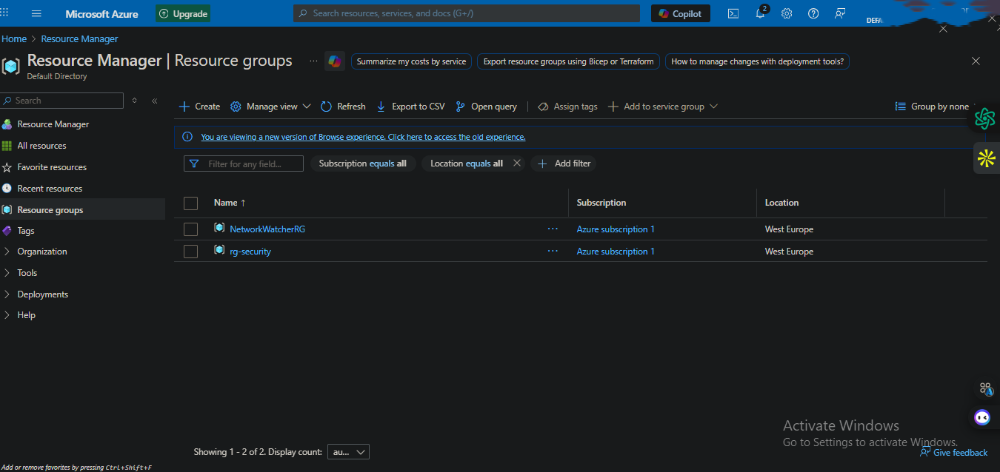
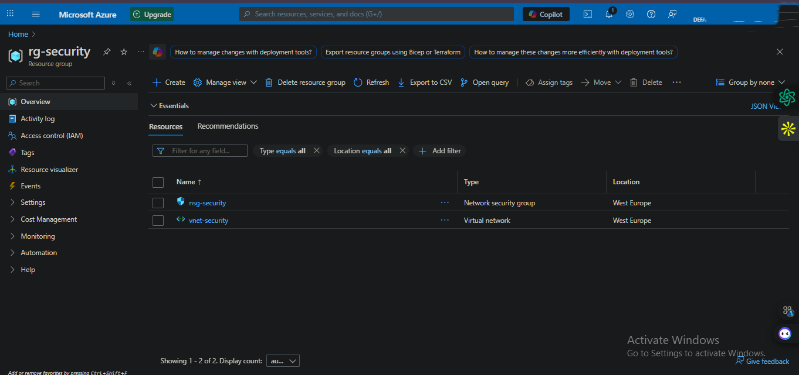
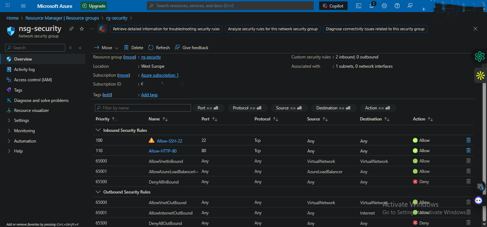
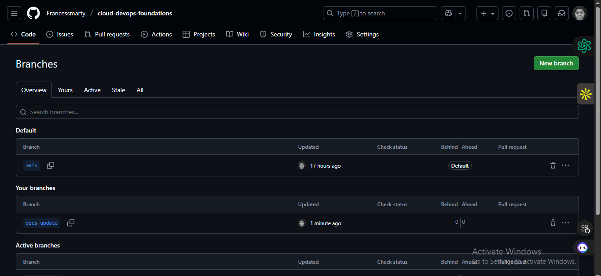
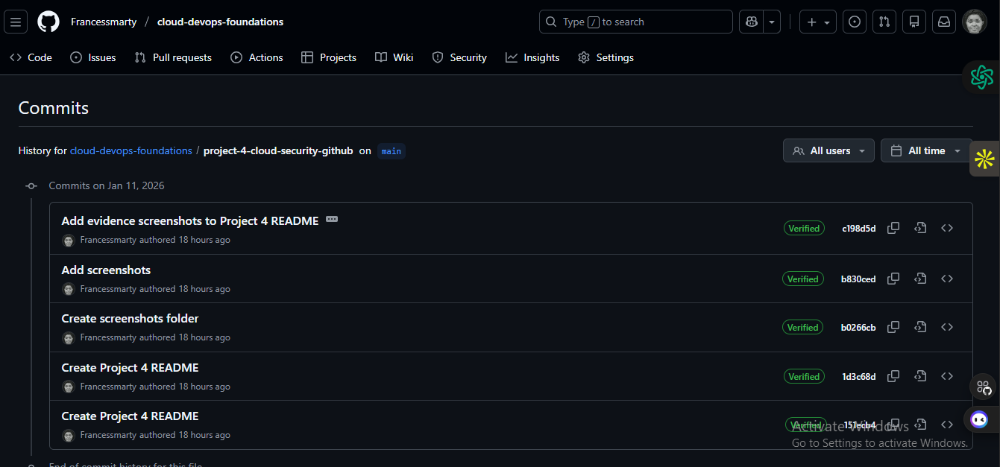
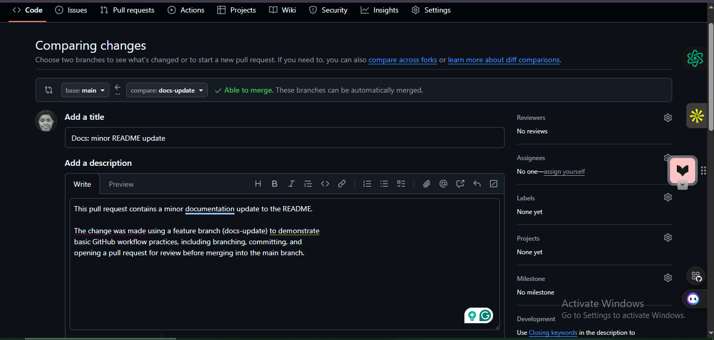
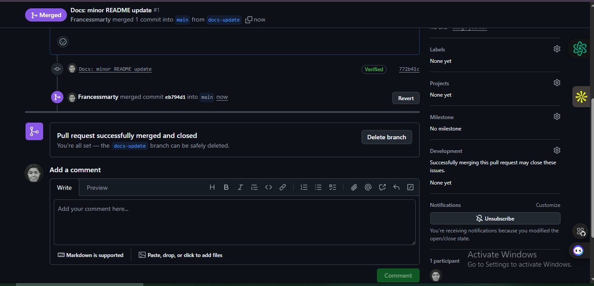

# Project 4: Cloud Foundations & GitHub Workflow

## Overview
This project focuses on reinforcing core cloud fundamentals in Microsoft Azure and practicing professional GitHub workflows.

The Azure work demonstrates basic resource organization and networking components, while the GitHub work focuses on documentation, commits, and pull request workflows commonly used in real-world projects.

---

## Objectives
- Create and manage Azure resources using the Azure Portal
- Understand basic virtual networking components (VNet, Subnet, NSG)
- Practice clear documentation using Markdown
- Demonstrate GitHub workflows including commits and pull requests

---

## What I Built (Azure)
- Created a dedicated Azure Resource Group
- Deployed a Virtual Network (VNet) and subnet
- Created and configured a Network Security Group (NSG)
- Added basic inbound rules:
  - Allow SSH (Port 22)
  - Allow HTTP (Port 80)
- Associated the NSG with the subnet
- Cleaned up resources after validation to avoid unnecessary costs

---

## GitHub Workflow Demonstrated
- Created a feature branch for documentation updates
- Made a small README change
- Committed changes with a clear commit message
- Opened a pull request for review
- Prepared the pull request for merge into the main branch

This reflects a standard GitHub documentation workflow used in collaborative environments.

---

## Evidence

### 1. Resource Group Created

This screenshot shows the successful creation of a dedicated Azure Resource Group.

---

### 2. Resource Group Resources (VNet + NSG)

This screenshot shows the resources inside the Resource Group, including the Virtual Network and Network Security Group.

---

### 3. NSG Inbound Rules

This screenshot shows the configured inbound rules allowing SSH and HTTP traffic.

---

### 4. GitHub Branch Created

This screenshot shows a feature branch created for documentation updates.
---

### 5. GitHub Commit (Documentation Update)

This screenshot shows a documentation commit made to the README file.

---

### 6. GitHub Pull Request Created

This screenshot shows the pull request created to merge documentation changes into the main branch.

---

### 7. Pull Request Open for Review

This screenshot shows the pull request open and ready for review with no conflicts detected.

---

### 8. Pull Request Merged

This screenshot shows the successful merge of the pull request into the main branch.

---

### Security Summary 

Security best practices were applied across CI, IAM, and VM access, including secret management, SSH hardening, and least-privilege principles.

---

## Key Learnings
- How Azure resources are organised using Resource Groups
- Basic virtual networking concepts in Azure
- The importance of documenting work clearly
- How GitHub commits and pull requests support structured collaboration
- Why “allow only what you need” is a core security principle
- Why documentation and cleanup matter in cloud environments
- How GitHub can be used to present work clearly for recruiters
