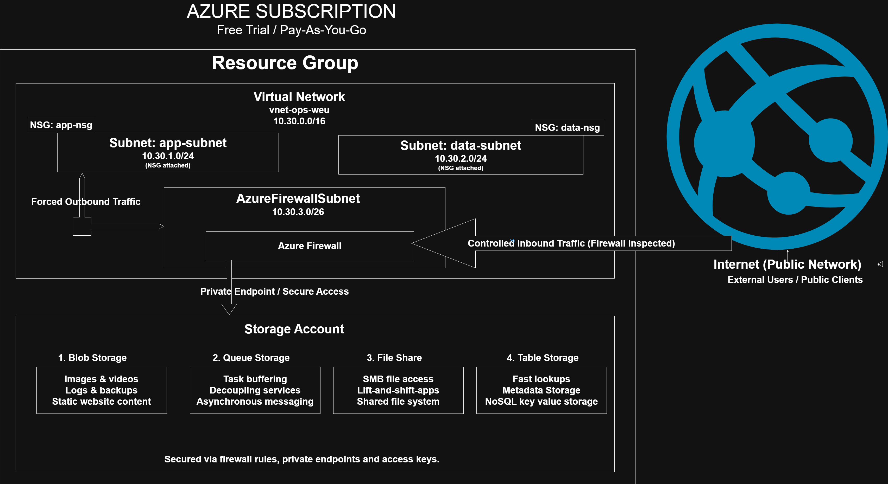

# Project 3: Azure Virtual Networks & Cloud Storage (Week 3)

## Overview
This project focuses on core Azure networking and storage concepts using a mix of
Azure Portal and Azure CLI. The goal is to understand how traffic flows inside a
virtual network and how different Azure storage services are used in practice.

---

## Objectives
- Create and configure an Azure Virtual Network (VNet)
- Design subnets for applications and data
- Deploy Azure Firewall and associate a public IP
- Configure a route table (UDR) to inspect outbound traffic via the firewall
- Create and manage Azure Storage services:
  - Blob Storage
  - File Share
  - Queue Storage
  - Table Storage
- Clean up all resources to avoid unnecessary costs

---

## Architecture Diagram
The diagram below illustrates the Azure Virtual Network design, firewall placement,
routing flow, and storage integration used in this project.

---

## Architecture Summary
- **VNet:** Single VNet in West Europe
- **Subnets:**
  - Application subnet
  - Data subnet
  - AzureFirewallSubnet (mandatory for Azure Firewall)
- **Firewall:**
  - Azure Firewall with public IP
  - Used as a traffic inspection point
- **Routing:**
  - User Defined Route (0.0.0.0/0) pointing to the firewall
- **Storage Account:**
  - Blob container
  - File share
  - Queue
  - Table

---

## Tools Used
- Azure Portal
- Azure CLI (Git Bash)
- GitHub for documentation

---

## Screenshots
Screenshots are stored in the `/screenshots` folder and include:
- Azure Firewall deployment
- Firewall public IP assignment
- Route table configuration
- Storage services creation
- Resource group deletion confirmation

---

## Cleanup
All resources were deleted by removing the resource group to ensure
no ongoing Azure costs.

---

## Key Learnings
- Difference between public and private IPs
- How Azure Firewall integrates with VNets
- How route tables control traffic flow
- Practical differences between Azure storage services
- Importance of resource cleanup in cloud environments
