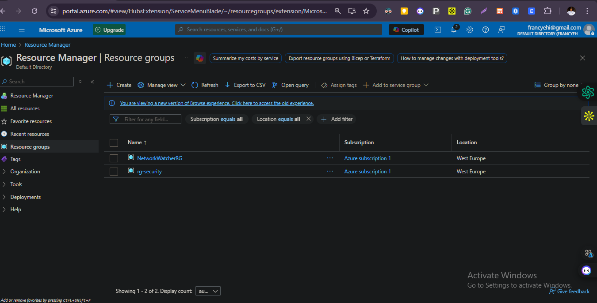
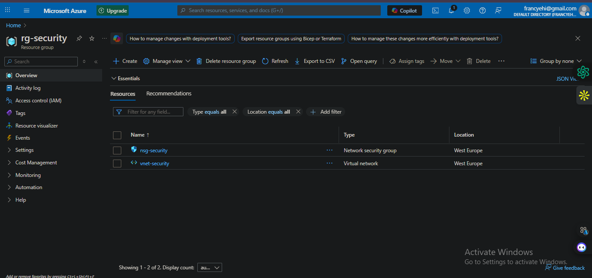
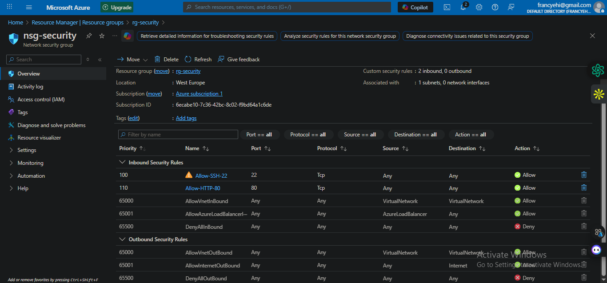

# Project 4: Cloud Security & GitHub Basics

## Overview
This project covers foundational cloud security concepts and basic GitHub workflows.
The Azure work focuses on Network Security Groups (NSGs) and safe resource management.
The GitHub work focuses on documenting projects clearly and practicing version control.

## Objectives
- Understand core cloud security concepts: IAM, encryption, and compliance (high level)
- Create and manage an Azure Resource Group for security resources
- Configure a Network Security Group (NSG) with inbound rules
- Document work in GitHub using a clean folder structure and clear commits

## What I Built (Azure)
- Created a dedicated Resource Group for Week 4 security work
- Deployed a VNet and subnet (basic network boundary)
- Created an NSG and configured inbound rules:
  - Allow SSH (Port 22)
  - Allow HTTP (Port 80)
- Associated the NSG to the subnet
- Deleted resources after validation to avoid unnecessary costs

## Security Notes (Concepts)
### Identity and Access Management (IAM)
IAM controls who can access resources and what actions they can perform. In Azure, IAM is implemented using RBAC (roles) at scopes like subscription, resource group, and resource level. For this lab, default permissions were used and actions were kept minimal to follow least privilege.

### Encryption and Best Practices
- Use HTTPS/TLS for secure communication
- Data at rest is encrypted by default in many Azure services
- Avoid exposing management ports publicly unless required (e.g., SSH)
- Prefer least privilege and explicit allow rules

### Compliance and Policies
Security compliance helps ensure systems meet standards and regulatory requirements (e.g., ISO 27001, SOC 2, GDPR). In practice, teams use policies, audits, and access controls to reduce risk.

## Evidence

### 1. Resource Group Created

This screenshot shows the successful creation of a dedicated Azure Resource Group used for security-related resources.

---

### 2. Resource Group Resources (VNet + NSG)

This screenshot shows the resources inside the security resource group, including the Virtual Network (VNet) and Network Security Group (NSG).

---

### 3. NSG Inbound Security Rules

This screenshot shows the configured inbound security rules:
- Allow SSH (Port 22)
- Allow HTTP (Port 80)
- Default deny rules for all other traffic

## Key Learnings
- How NSGs control inbound/outbound traffic using rules and priorities
- Why “allow only what you need” is a core security principle
- Why documentation and cleanup matter in cloud environments
- How GitHub can be used to present work clearly for recruiters
